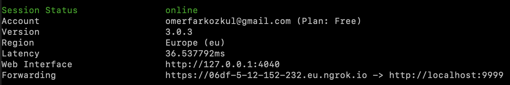

# SPM-SlackBot
A slack bot built using Slack API and Express.js

## Local development/running
 - When running this project you will need a slack app. Create one from slack's website and create a config.js file
 - The contents of the config.js file should be similar to
 `module.exports = {
  botToken: "bot token for your app",
  ceoId: 'ID of a registered user in the app/workspace'
};
` 
 - Setup [ngrok](https://dashboard.ngrok.com/get-started/setup)
 - Run `ngrok http 9999`
 - Use the forwarding link on your slack app like such `https://.......eu.ngrok.io/purchase`
  
 - Make sure you edit the url under 'https://api.slack.com/apps/your_app_id/interactive-messages' to make it look like
 
 - Run `npm install`
 - Run `node purchase-slash-command.js`
 - As long as your app is connected the app should be functional now!

### Example ngrok output
